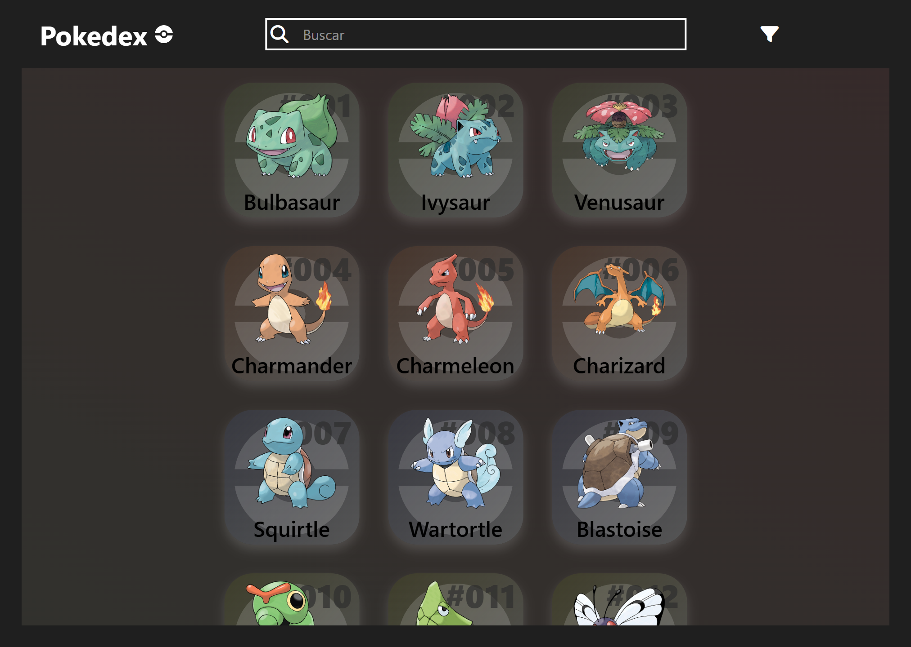
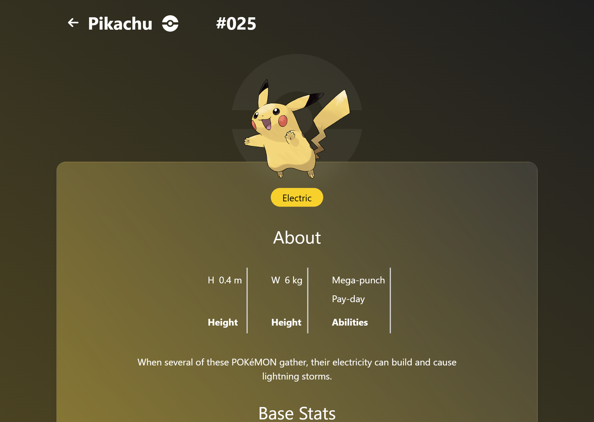

# 🧩 PokeApi

Una Pokédex interactiva hecha con **React** y **TailwindCSS**.  
Este proyecto forma parte de mi portfolio y utiliza la API pública de **PokeAPI** para mostrar y explorar Pokémon con filtros y búsqueda en tiempo real.

---

## 📸 Vista previa

<!-- Reemplazá esto con una captura de tu app -->



---

## 🚀 Demo

[Poke-API](https://pokedexapi-psi.vercel.app)

---

## ✨ Funcionalidades

- 🔎 Buscar Pokémon por nombre o número
- 🔥 Filtrar por tipo (fuego, agua, planta, etc.)
- 🎨 Interfaz responsive con diseño moderno
- ⚡ Mostrar los primeros 151 Pokémon (Kanto)
- 📋 Ver detalles completos de cada Pokémon (altura, peso, movimientos, etc.)
- 🌀 Explorar la cadena de evoluciones de cada Pokémon

---

## 🛠️ Tecnologías usadas

- ⚛️ React
- 🎨 TailwindCSS
- 🔗 PokeAPI

---

## 🧪 Instalación y ejecución local

1. **Clonar el repositorio**

```bash
git clone https://github.com/EEAlvarez05/Poke-Api.git
```

2. **Instalar dependencias**

```bash
cd Poke-Api
npm install
```

3. **Iniciar el servidor de desarollo**

```bash
npm run dev
```

4. **Abrí el nagevador y andá a:**

localhost:5173 (o el puerto que te indique Vite)

---

## 🧑‍💻 Autor

**Ezequiel Alvarez**

🌐 [Portfolio](https://ezequiel-alvarez.vercel.app/)

💼 [LinkedIn](https://www.linkedin.com/in/ezequiel-alvarez-16938729b/)

---

## 📌 Notas

- El proyecto usa Vite para desarrollo rápido en React.
- La API usada es completamente gratuita.
- Este proyecto fue creado con fines educativos y para mostrar habilidades front-end.

¡Gracias por visitar el repositorio! 😊
Si te gustó, no dudes en dejar una ⭐ en GitHub.


